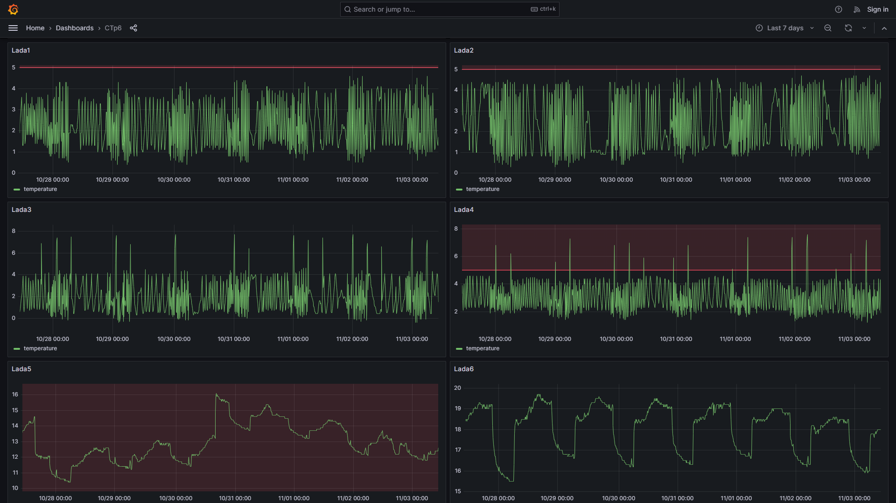
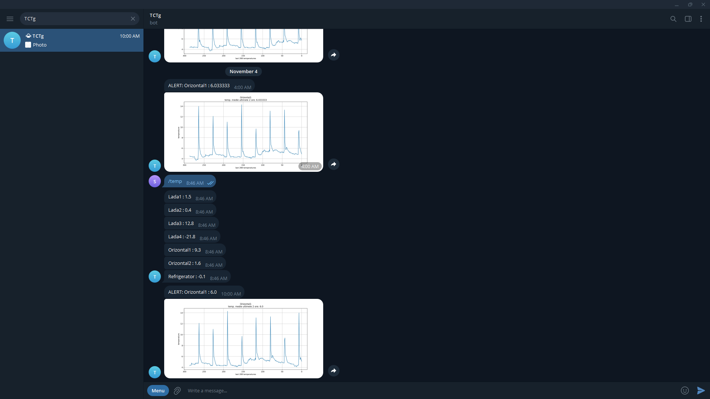

# tempLog
This is made to run on the Raspberry Pi 32 bit version.

Python scripts for recording and alerting *(Telegram)* about fridge temperatures using DS18B20 sensors.

## Grafana & Telegram

## DS18B20 Serial Numbers
### CTg
- 28-01144f4794aa	Lada1
- 28-01144f51f9aa	Lada2
- 28-01144f5062aa	Lada3
- 28-0114535388aa	Lada4
- 28-011937c7f1ec	Orizontal1
- 28-011937d38394	Orizontal2
- 28-0301a2793b45	Refrigerator
### CTp6
- 28-0114535371aa	CRP1
- 28-01144f3b3daa	CRP2
- 28-01145346eeaa	Lada1
- 28-0114534e88aa	Lada2
- 28-0114533d0daa	Lada3
- 28-011453479caa	Lada4
- 28-01144f52d5aa	Lada5
- 28-01144f3cb6aa	Lada6
- 28-0301a279fb44	Refrigerator
### Fet
- 28-0301a279238a	Lada1
- 28-3c01a8169ad6	Lada2
- 28-01193811282b	Lada3
- 28-011937aa85f3	Lada4
- 28-3c01a816d398	Refrigerator

## Additional libraries
- [guizero](https://pypi.org/project/guizero/)
- [gpiozero](https://pypi.org/project/gpiozero/)
- [telepot](https://pypi.org/project/telepot/)
- [matplotlib](https://pypi.org/project/matplotlib/)
- python-mysqldb (apt)
- apache2 (apt)
- mariadb-server (apt)
- php-mysql (apt)
- phpmyadmin (apt)

## Crontab
### sudo
- */10 * * * * python /home/pi/tempLog/readTempSQL.py temp_database
- 0 */2 * * * python /home/pi/tempLog/readTempSQL.py temperaturi
- 0 */2 * * * python /home/pi/tempLog/alertTemp.py
- 5 0 1 * * /home/pi/tempBKP/bkp_db.sh
- @reboot python /home/pi/startup.py &
- @reboot python /home/pi/tempLog/msgTemp.py &
- 0 0 * * 1 /sbin/shutdown -r

\# For rpi4fet (crelay)
- @reboot /usr/local/bin/crelay -D &
- @reboot python /home/pi/crelayStartup.py &
